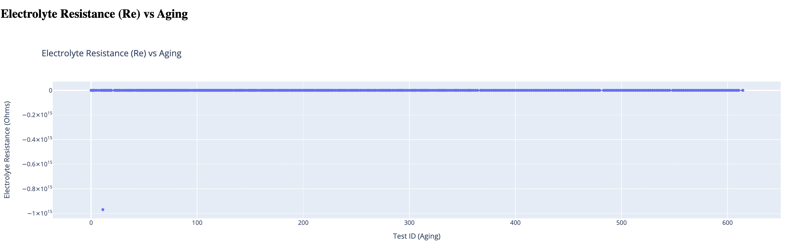
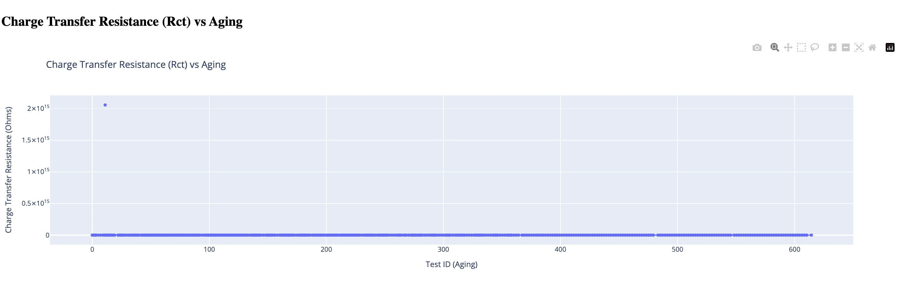
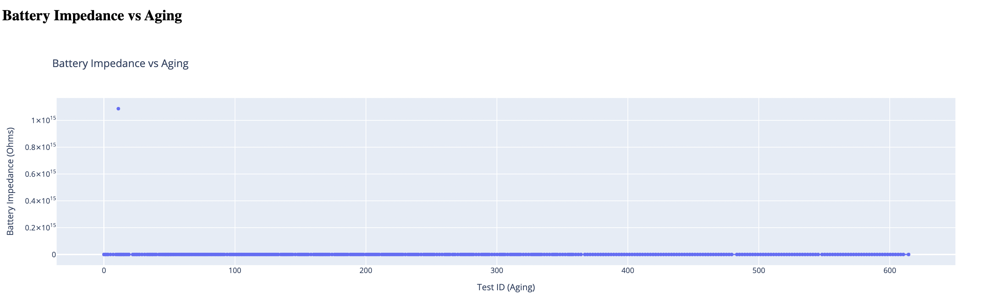

Battery Impedance Analysis Dashboard
====================================

This Django-based web application enables users to upload CSV files containing battery performance data, process the data, and visualize the aging of batteries through various parameters, including **Electrolyte Resistance (Re)**, **Charge Transfer Resistance (Rct)**, and **Battery Impedance**.

Features
--------

*   Upload CSV files containing battery data.
*   Calculate **Battery Impedance** as the sum of **Re** and **Rct**.
*   Generate interactive plots using Plotly:
    *   **Electrolyte Resistance (Re) vs Aging**
    *   **Charge Transfer Resistance (Rct) vs Aging**
    *   **Battery Impedance vs Aging**
*   Visualize trends with a **LOWESS** trendline.

# Battery Impedance Analysis Dashboard

This Django-based web application enables users to visualize battery aging parameters.

## Features
- Upload CSV files containing battery data.
- Visualize key parameters such as Re, Rct, and Battery Impedance using interactive plots.

## Graphs

### 1. Electrolyte Resistance (Re) vs Aging

### 2. Charge Transfer Resistance (Rct) vs Aging

### 3. Battery Impedance vs Aging

* * *

Logic Behind the Application
----------------------------

### Battery Parameters

*   **Electrolyte Resistance (Re)**: Represents the resistance offered by the electrolyte in the battery.
*   **Charge Transfer Resistance (Rct)**: Represents the resistance to charge transfer at the electrode-electrolyte interface.
*   **Battery Impedance**: Calculated as the sum of `Re` and `Rct`.

### Data Processing

1.  **Upload and Parse**:
    
    *   The user uploads a CSV file, which is read using **Pandas**.
    *   `Re` and `Rct` values are extracted, ensuring any complex numbers are reduced to their real parts.
2.  **Data Cleaning**:
    
    *   Invalid or missing values in `Re` or `Rct` are dropped to ensure clean data for plotting.
3.  **Battery Impedance Calculation**:
    
    *   A new column, `Battery_Impedance`, is computed as the sum of `Re` and `Rct`.
4.  **Interactive Visualization**:
    
    *   **Plotly** is used to create dynamic scatter plots for each parameter (`Re`, `Rct`, and Battery Impedance) against `test_id` (representing aging).
    *   A **LOWESS trendline** is added to each plot to highlight trends as the battery ages.

* * *

About Plotly
------------

[Plotly](https://plotly.com/) is a Python-based graphing library that enables the creation of highly interactive, publication-quality visualizations. In this project:

*   **Scatter plots** are used to display relationships between battery aging and internal parameters.
*   **Dynamic interactivity**:
    *   Hover to inspect data points.
    *   Zoom and pan for detailed exploration.
*   **Trendlines**: LOWESS (Locally Weighted Scatterplot Smoothing) trendlines are added to provide insights into how the parameters change over time.

* * *

Installation
------------

### Prerequisites

*   Python 3.8+
*   Django 4.0+
*   Plotly
*   Pandas
*   Statsmodels (for trendlines)

### Step-by-Step Setup

1.  **Clone the Repository**
    
    `git clone https://github.com/kunalarya873/think-clock-innov`

    `cd think-clock-innov/` 
    
2.  **Set Up a Virtual Environment**
    
    `python -m venv venv`

    `source venv/bin/activate`

    On Windows: `venv\Scripts\activate` 
    
3.  **Install Dependencies**
    
    `pip install -r requirements.txt` 
    
4.  **Run Database Migrations**
    
    `python manage.py migrate` 
    
5.  **Start the Development Server**
    
    `python manage.py runserver` 
    
6.  **Access the Application** Open your web browser and navigate to:
    
    `http://127.0.0.1:8000/` 
    

* * *

Usage
-----

1.  **Upload a CSV File**:
    
    *   The CSV file should contain columns like `test_id`, `Re`, and `Rct`.
2.  **View Plots**:
    
    *   After the file is uploaded, the application calculates `Battery Impedance` and generates the following plots:
        *   **Electrolyte Resistance (Re) vs Aging**
        *   **Charge Transfer Resistance (Rct) vs Aging**
        *   **Battery Impedance vs Aging**

* * *

Project Structure
-----------------

`battery_impedance_dashboard/
├── app/                 # Main app handling uploads and visualizations
│   ├── templates/             # HTML templates
│   │   ├── upload.html        # Upload page
│   │   ├── plot.html          # Plot display page
│   ├── views.py               # Main logic for processing and plotting
│   ├── urls.py                # App-specific URL configurations
├── static/                    # Static files
├── media/                     # Uploaded CSV files (if enabled)
├── settings.py                # Django project settings
├── urls.py                    # Project-wide URL configurations
├── manage.py                  # Django entry point
└── README.md                  # This file` 

* * *

Example CSV Format
------------------

`test_id,Re,Rct
1,0.05,0.10
2,0.06,0.11
3,0.07,0.12` 

* * *

Requirements
------------

*   Django
*   Pandas
*   Plotly
*   Statsmodels

Install them with:

`pip install django pandas plotly statsmodels` 

* * *

